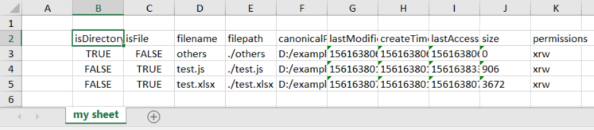

# How to - Excel files

All the functions to read and write excel files are organized under the plugin object "XLS". To use the plugin in your OpenAF code you need to add, before using the functionality, the following line:

````javascript
plugin("XLS");
````

## Reading an excel file

*tbc*
([Get a javascript array from an Excel](https://openafs.blogspot.com/2019/07/get-javascript-array-from-excel.html))

## Writing an excel file

### Adding a simple array

One of the most handy features is the ability to write a simple javascript array of maps (with non complex sub maps/arrays, just plain strings/numbers):

````javascript
var path = ".";
log("Listing the files on '" + path + "'...");
var listOfFiles = io.listFiles(path).files; 
// files is an array returned by io.listFiles with filesystem details of files & folders on the provided path

log("Preparing the excel file...");
plugin("XLS");

// Creates a new instance of the XLS object provided by the XLS plugin
var xls = new XLS(); 
// Determines in which sheet the array will be added
var sheet = xls.getSheet("my sheet"); 

// Writes all the array elements and corresponding properties to the provided sheet starting on excel position B2.
xls.setTable(sheet, "B", "2", listOfFiles); 

var outputFile = "test.xlsx";
log("Writing the excel file to '" + outputFile + "'...");
// Writes the prepared excel to a xls/xlsx file.
xls.writeFile(outputFile);
xls.close(); // Don't forget to close the object to free up used files and resources before using the generated excel file.
````

And the resulting excel file would look similar to this:



*tbc*

### Using a template

([Adding a javascript array to an Excel spreadsheet](https://openafs.blogspot.com/2019/07/adding-array-to-excel-spreadsheet.html))

## Formatting an excel file

*tbc*